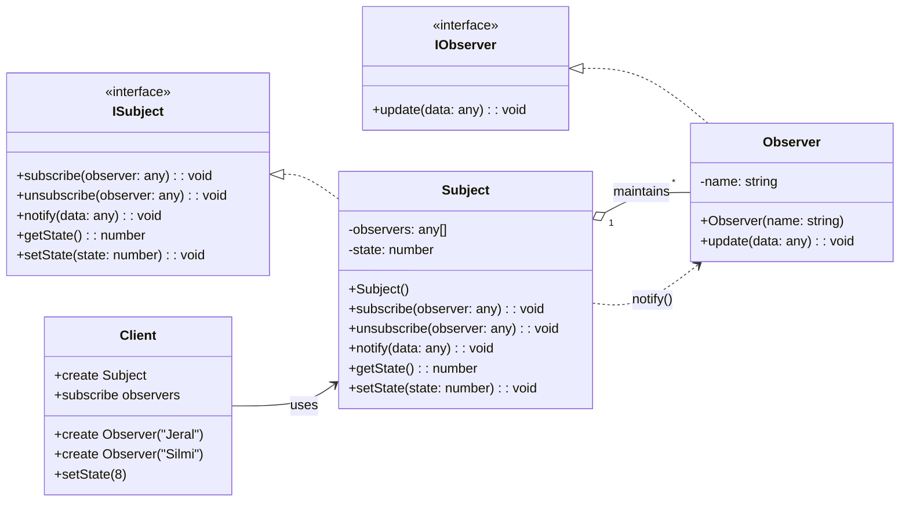

# Observer Pattern

```mermaid
classDiagram
    direction LR

    class IObserver {
        <<interface>>
        +update(data: any): void
    }

    class ISubject {
        <<interface>>
        +subscribe(observer: any): void
        +unsubscribe(observer: any): void
        +notify(data: any): void
        +getState(): number
        +setState(state: number): void
    }

    class Observer {
        -name: string
        +Observer(name: string)
        +update(data: any): void
    }

    class Subject {
        -observers: any[]
        -state: number
        +Subject()
        +subscribe(observer: any): void
        +unsubscribe(observer: any): void
        +notify(data: any): void
        +getState(): number
        +setState(state: number): void
    }

    class Client {
        +create Subject
        +create Observer("Jeral")
        +create Observer("Silmi")
        +subscribe observers
        +setState(8)
    }

    IObserver <|.. Observer
    ISubject <|.. Subject

    Subject "1" o-- "*" Observer : maintains

    Client --> Subject : uses

    Subject ..> Observer : notify()
```
